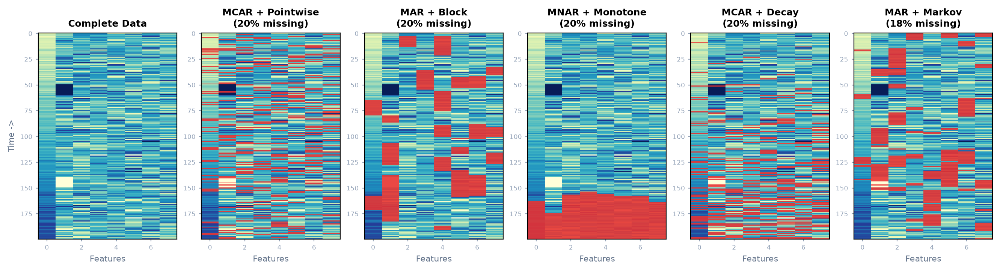
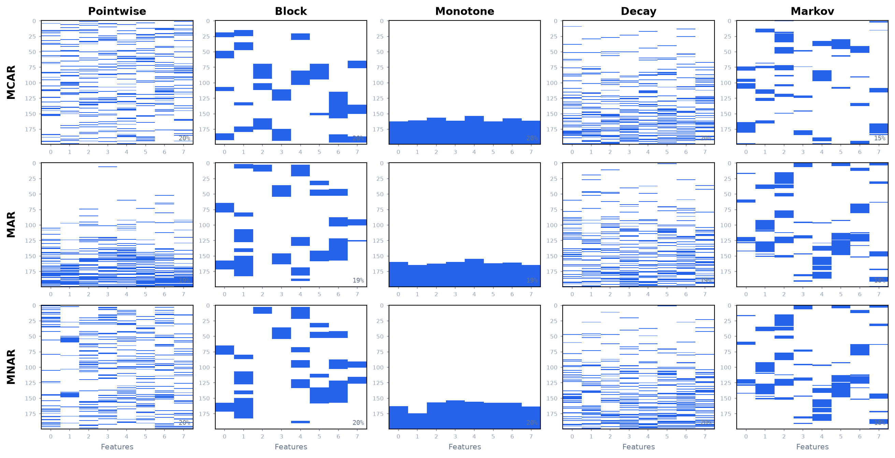

# TSGap

A Python library for simulating realistic missingness in time-series data for imputation benchmarking.

Explicitly separates **mechanisms** (why data is missing: MCAR, MAR, MNAR) from **patterns** (how data is missing: pointwise, block, monotone, decay, markov). Any mechanism can be combined with any pattern. Supports 2D and 3D arrays, exact or calibrated rate control, weighted multi-driver MAR, and full reproducibility.



Each panel shows a (200 timesteps × 8 features) array as a heatmap. The color scale represents data values: yellow = low values, green = mid-range values, blue = high values. Red cells are missing values overlaid on top of the data. The first panel shows the complete dataset with no missingness. The remaining five panels each apply a different mechanism+pattern combination at 20% missing rate, so you can see exactly how each configuration removes data:

- MCAR + Pointwise: red cells scattered uniformly at random across the entire array.
- MAR + Block: red cells appear in contiguous horizontal bands, concentrated in regions where the driver variable (dim 0, which ramps up over time) has high values.
- MNAR + Monotone: each feature column has a clean cutoff point — everything after the dropout time is solid red, modeling permanent sensor failure.
- MCAR + Decay: red cells are sparse at the top (early timesteps) and dense at the bottom (late timesteps), modeling gradual sensor degradation.
- MAR + Markov: bursty red streaks that flicker on and off along the time axis, with burst locations influenced by the driver variable.

---

## Installation

```bash
pip install -e .
```

Requires Python ≥ 3.9 and NumPy ≥ 1.19.

---

## Quick Start

```python
import numpy as np
from tsgap import simulate_missingness

X = np.random.randn(1000, 6)  # (T, D) — 1000 timesteps, 6 features

# MCAR: 15% scattered missing (default pattern)
X_miss, mask = simulate_missingness(X, "mcar", 0.15, seed=42)

# MAR: 25% missing in contiguous blocks, driven by dimension 0
X_miss, mask = simulate_missingness(
    X, "mar", 0.25, seed=42,
    pattern="block", driver_dims=[0], block_len=10
)

# MNAR: 20% extreme values missing with monotone dropout
X_miss, mask = simulate_missingness(
    X, "mnar", 0.20, seed=42,
    pattern="monotone", mnar_mode="extreme"
)

# MAR: weighted multi-driver with temporal decay
X_miss, mask = simulate_missingness(
    X, "mar", 0.30, seed=42,
    pattern="decay", driver_dims=[0, 1], driver_weights=[0.8, 0.2],
    decay_rate=5.0, decay_center=0.6
)

# MCAR: intermittent flickering with Markov chain dependence
X_miss, mask = simulate_missingness(
    X, "mcar", 0.20, seed=42,
    pattern="markov", persist=0.8
)

print(f"Actual missing rate: {(~mask).mean():.4f}")
```

---

## Core Concept: Mechanisms × Patterns

The library separates two orthogonal concerns:

**Mechanisms** answer *why* data is missing — the probabilistic relationship between missingness and data values:

| Mechanism | Description | Rate Control |
|-----------|-------------|--------------|
| `mcar` | Independent of all data | Exact |
| `mar` | Depends on other observed variables | Calibrated |
| `mnar` | Depends on the missing value itself | Calibrated |

**Patterns** answer *how* data is missing — the temporal/spatial structure:

| Pattern | Aliases | Description |
|---------|---------|-------------|
| `pointwise` | `point`, `scattered` | Individual scattered points (default) |
| `block` | `contiguous` | Contiguous segments (sensor dropout) |
| `monotone` | `dropout` | Once missing, stays missing (participant dropout) |
| `decay` | `degradation` | Missingness increases over time (sensor degradation) |
| `markov` | `flickering` | Temporally dependent bursts (intermittent sensor failure) |

Any mechanism can be combined with any pattern:

| Combination | Real-World Scenario |
|-------------|---------------------|
| MCAR + pointwise | Random transmission errors |
| MCAR + block | Random battery depletion periods |
| MAR + block | Activity-dependent sensor dropout |
| MAR + decay | Sensor degrades faster under load |
| MNAR + monotone | Extreme readings cause permanent sensor failure |
| MNAR + pointwise | Sensor saturates at extreme values |
| MCAR + markov | Random intermittent connectivity drops |
| MAR + markov | Load-dependent flickering sensor |



The grid above shows all 15 possible mechanism × pattern combinations. Each cell is a (200 × 8) missingness mask where blue cells are missing and white cells are observed. Rows vary the mechanism (MCAR, MAR, MNAR) and columns vary the pattern (pointwise, block, monotone, decay, markov). The percentage in each cell's corner is the actual achieved missing rate. Notice how MCAR rows look uniform across features, MAR rows concentrate missingness where the driver is high, and MNAR rows target extreme data values — while the column patterns independently control the temporal shape.

---

## Mask Convention

```
mask == True  → observed
mask == False → missing
```

This allows direct evaluation:

```python
missing_idx = ~mask
rmse = np.sqrt(np.mean((X[missing_idx] - X_imputed[missing_idx]) ** 2))
```

---

## Mathematical Background: The Sigmoid Function

Several mechanisms and patterns in this library use the sigmoid (logistic) function to convert raw scores into probabilities. Since it appears repeatedly, we define it once here:

$$\sigma(x) = \frac{1}{1 + e^{-x}}$$

The sigmoid takes any real number $x$ and maps it to a value between 0 and 1. When $x = 0$, the output is 0.5. As $x$ grows large and positive, the output approaches 1. As $x$ grows large and negative, the output approaches 0. This makes it ideal for converting scores into probabilities.

The figure below shows how the sigmoid is applied in each context:


- Panel 1 (Sigmoid Function): the basic S-curve. Input $x$ on the horizontal axis, output probability $\sigma(x)$ on the vertical axis. The key point $(0, 0.5)$ is marked — this is where the function crosses 50%.
- Panel 2 (MAR Strength): shows how the `strength` parameter $\alpha$ controls the steepness of the probability curve. With $\alpha = 0.5$ (weak), the curve is nearly flat — all driver values produce similar missing probabilities. With $\alpha = 5.0$ (strong), the curve is steep — low driver values rarely cause missingness while high driver values almost always do.
- Panel 3 (MNAR Modes): shows the three score functions. "High" mode ($f(z) = z$, red) targets high values. "Low" mode ($f(z) = -z$, blue) targets low values. "Extreme" mode ($f(z) = |z|$, purple) creates a U-shape that targets both tails, with values near the mean having the lowest missing probability.
- Panel 4 (Decay Ramp): shows how `decay_rate` ($\gamma$) and `decay_center` ($c$) control the temporal weight curve. The default ($\gamma=3, c=0.7$) gives a smooth transition with most missingness in the last 30% of the series. A steep early configuration ($\gamma=6, c=0.5$) creates a sharp step at the midpoint. A gentle late configuration ($\gamma=2, c=0.8$) gives a gradual ramp concentrated at the very end.

---

## Mechanisms

### MCAR — Missing Completely At Random

Missingness is independent of all data — every eligible position has the same probability of being missing, regardless of its value or the values of other variables.

$$P(M_{ij} = 1) = \rho$$

Variable definitions:
- $M_{ij}$ — the missingness indicator for position $(i, j)$, where $i$ is the timestep and $j$ is the feature dimension. $M_{ij} = 1$ means the value is missing; $M_{ij} = 0$ means it is observed.
- $\rho$ — the target missing rate, a number between 0 and 1 (e.g., 0.15 means 15% missing). This is the `missing_rate` parameter.

Step-by-step procedure:
1. Count the number of eligible positions $n_{\text{eligible}}$ (all non-NaN entries in the target dimensions).
2. Compute the number of positions to mask: $n_{\text{mask}} = \text{round}(n_{\text{eligible}} \times \rho)$.
3. Randomly sample exactly $n_{\text{mask}}$ positions uniformly without replacement.
4. Set those positions to missing.

Because MCAR uses sampling without replacement, the achieved missing rate is exact (not approximate).

```python
X_miss, mask = simulate_missingness(X, "mcar", 0.15, seed=42)
```

**Parameters:**
- `target`: `"all"` (default) or list of dimension indices to mask, e.g. `[0, 2]`

---

### MAR — Missing At Random

Missingness depends on other observed variables (called "drivers") but not on the missing value itself. For example, a heart rate sensor might fail more often during high physical activity — the activity level (observed) drives the missingness of heart rate.

The probability of each position being missing is computed using a logistic model:

$$P(M_{ij} = 1 \mid X) = \sigma(\alpha \cdot z_i + \beta)$$

Variable definitions:
- $M_{ij}$ — missingness indicator for timestep $i$, feature $j$. Equals 1 if missing, 0 if observed.
- $X$ — the full input data matrix.
- $z_i$ — the normalized driver signal at timestep $i$ (see below). This is a single number summarizing the driver variables at that timestep.
- $\alpha$ — the strength parameter (`strength`). Controls how strongly the driver influences missingness. Higher $\alpha$ means the driver has more influence. Must be $\geq 0$.
- $\beta$ — the calibrated offset. This is automatically computed by the library (via binary search) so that the overall missing rate matches the target $\rho$. You do not set this directly.
- $\sigma(\cdot)$ — the sigmoid function defined above.

Computing the driver signal $z_i$:

When a single driver dimension $k$ is used:

$$z_i = \frac{X_{i,k} - \mu_k}{\sigma_k}$$

where:
- $X_{i,k}$ — the raw value of driver dimension $k$ at timestep $i$.
- $\mu_k$ — the mean of dimension $k$ across all timesteps.
- $\sigma_k$ — the standard deviation of dimension $k$ across all timesteps.

This normalization (z-scoring) ensures the driver signal has mean 0 and standard deviation 1, so the strength parameter $\alpha$ has a consistent effect regardless of the driver's original scale.

When multiple driver dimensions are used with weights:

$$z_i = \sum_{k} w_k \cdot \frac{X_{i,k} - \mu_k}{\sigma_k}$$

where:
- $w_k$ — the weight for driver dimension $k$ (`driver_weights`). Weights are automatically normalized to sum to 1. If not specified, all drivers contribute equally (simple mean).

Step-by-step procedure:
1. Extract the driver dimensions from the data and compute the weighted, normalized driver signal $z_i$ for each timestep.
2. If `direction="negative"`, flip the sign: $z_i \leftarrow -z_i$.
3. For a candidate offset $\beta$, compute probabilities: $p_{ij} = \sigma(\alpha \cdot z_i + \beta)$.
4. Ensure a minimum probability floor: $p_{ij} = \max(p_{ij}, p_{\text{base}})$, where $p_{\text{base}}$ is the `base_rate` parameter.
5. Calibrate $\beta$ via binary search: find the value of $\beta$ such that the average probability over all eligible positions equals the target rate $\rho$.
6. Sample missingness: for each eligible position, draw a random number $u_{ij} \sim \text{Uniform}(0, 1)$. If $u_{ij} < p_{ij}$, the position is missing.

Because MAR uses Bernoulli sampling (each position is an independent coin flip), the achieved rate is approximate — it fluctuates around the target, especially for small datasets. For large datasets, the law of large numbers ensures convergence.

```python
# Single driver
X_miss, mask = simulate_missingness(
    X, "mar", 0.25, seed=42,
    driver_dims=[0], strength=2.0
)

# Weighted multi-driver: 80% activity, 20% temperature
X_miss, mask = simulate_missingness(
    X, "mar", 0.25, seed=42,
    driver_dims=[0, 1], driver_weights=[0.8, 0.2], strength=2.0
)
```

**Parameters:**
- `driver_dims`: list of dimension indices that drive missingness (default: `[0]`)
- `driver_weights`: weights for each driver (auto-normalized, default: equal)
- `target`: `"all"` or list of dimension indices to mask
- `strength`: dependency strength $\alpha$, $\geq 0$ (default: `2.0`)
- `base_rate`: minimum probability floor $p_{\text{base}}$ (default: `0.01`)
- `direction`: `"positive"` (high driver $\rightarrow$ high missing) or `"negative"` (high driver $\rightarrow$ low missing)

---

### MNAR — Missing Not At Random

Missingness depends on the value itself — the very value that would be missing is what determines whether it goes missing. For example, a temperature sensor might saturate and fail to record extreme readings, or a medical device might have a detection limit that causes very low values to be unrecorded.

$$P(M_{ij} = 1 \mid X_{ij}) = \sigma(\alpha \cdot f(z_{ij}) + \beta)$$

Variable definitions:
- $M_{ij}$ — missingness indicator for timestep $i$, feature $j$.
- $X_{ij}$ — the actual data value at position $(i, j)$. This is the value that influences its own missingness.
- $z_{ij}$ — the z-scored (normalized) value at position $(i, j)$, computed per feature dimension.
- $f(\cdot)$ — the score function that determines which values are more likely to be missing (depends on `mnar_mode`, see table below).
- $\alpha$ — the strength parameter (`strength`). Controls how strongly the value influences its own missingness.
- $\beta$ — the calibrated offset, automatically computed via binary search to match the target rate $\rho$.
- $\sigma(\cdot)$ — the sigmoid function.

Computing the normalized value $z_{ij}$:

$$z_{ij} = \frac{X_{ij} - \mu_j}{\sigma_j}$$

where:
- $\mu_j$ — the mean of feature $j$ across all timesteps.
- $\sigma_j$ — the standard deviation of feature $j$ across all timesteps.

Each feature is normalized independently, so a "high" value in one feature is comparable to a "high" value in another, regardless of their original scales.

The score function $f(z)$ determines which values are targeted:

| Mode | $f(z)$ | Effect | Example |
|------|--------|--------|---------|
| `"high"` | $z$ | Higher values $\rightarrow$ higher probability of missing | Sensor ceiling effect |
| `"low"` | $-z$ | Lower values $\rightarrow$ higher probability of missing | Detection limit |
| `"extreme"` | $\|z\|$ | Values far from the mean (in either direction) $\rightarrow$ higher probability of missing | Sensor saturation at both extremes |

Step-by-step procedure:
1. Normalize each feature independently: $z_{ij} = (X_{ij} - \mu_j) / \sigma_j$.
2. Compute the score: $s_{ij} = f(z_{ij})$ based on the chosen mode.
3. For a candidate offset $\beta$, compute probabilities: $p_{ij} = \sigma(\alpha \cdot s_{ij} + \beta)$.
4. Calibrate $\beta$ via binary search so the average probability over eligible positions equals $\rho$.
5. Sample missingness: for each eligible position, draw $u_{ij} \sim \text{Uniform}(0, 1)$. If $u_{ij} < p_{ij}$, the position is missing.

Like MAR, the achieved rate is approximate due to Bernoulli sampling.

```python
X_miss, mask = simulate_missingness(
    X, "mnar", 0.15, seed=42,
    mnar_mode="extreme", strength=3.0
)
```

**Parameters:**
- `mnar_mode`: `"extreme"` (default), `"high"`, or `"low"`
- `target`: `"all"` or list of dimension indices to mask
- `strength`: dependency strength $\alpha$, $\geq 0$ (default: `2.0`)

---

## Patterns

### Pointwise (default)

Individual points are missing independently. This is the default — no additional parameters needed.

```python
X_miss, mask = simulate_missingness(X, "mcar", 0.15, seed=42)
# equivalent to: pattern="pointwise"
```

---

### Block

Converts scattered missingness into contiguous segments. Simulates sensor dropout periods where a device goes offline for multiple consecutive timesteps.

```python
X_miss, mask = simulate_missingness(
    X, "mcar", 0.20, seed=42,
    pattern="block", block_len=10, block_density=0.7
)
```

**Parameters:**
- `block_len`: length of each missing block in timesteps (default: `10`)
- `block_density`: fraction of total missingness allocated to blocks, 0.0–1.0 (default: `0.7`)

**Use cases:** battery depletion, device removal, connectivity loss.

---

### Monotone

Once a dimension goes missing at time $t$, it stays missing for all $t' > t$. Models participant dropout in longitudinal studies and clinical trials.

The mechanism mask determines *how much* each dimension should be missing. Dimensions that the mechanism targeted more heavily get earlier dropout times. This preserves the mechanism's influence:
- Under MCAR, dropout times are roughly uniform with small random variation.
- Under MAR, dimensions driven by high-valued drivers drop out earlier.
- Under MNAR, dimensions with more extreme values drop out earlier.

The dropout time $\tau_d$ for each dimension $d$ is computed by allocating the total missing budget proportionally to the mechanism's per-dimension missing density:

$$\tau_d = T - \text{round}\!\left(\frac{\delta_d}{\sum_k \delta_k} \cdot n_{\text{target}}\right)$$

Variable definitions:
- $\tau_d$ — the dropout time for dimension $d$. All timesteps from $\tau_d$ onward are missing.
- $T$ — the total number of timesteps.
- $\delta_d$ — the missing density for dimension $d$ from the mechanism mask, i.e., the fraction of timesteps the mechanism marked as missing in that dimension.
- $\sum_k \delta_k$ — the sum of densities across all dimensions (used for normalization).
- $n_{\text{target}}$ — the total number of missing positions to achieve (from the mechanism).

Step-by-step procedure:
1. The mechanism (MCAR/MAR/MNAR) generates a scattered mask.
2. For each dimension $d$, compute its missing density $\delta_d$ = (number of missing positions in dim $d$) / $T$.
3. Allocate the total missing budget $n_{\text{target}}$ across dimensions proportionally to their densities.
4. Convert each allocation to a dropout time: $\tau_d = T - n_{\text{allocated},d}$.
5. Fix rounding errors by adjusting the highest/lowest density dimensions by ±1 step.
6. Build the monotone mask: for each dimension, set all positions from $\tau_d$ onward to missing.

The monotone constraint is strictly enforced: once a dimension drops out, it never comes back. The total missing count matches the mechanism's target exactly.

```python
X_miss, mask = simulate_missingness(
    X, "mcar", 0.20, seed=42, pattern="monotone"
)

# Verify: no observed values after first missing in each dimension
for d in range(X.shape[1]):
    missing_t = np.where(~mask[:, d])[0]
    if len(missing_t) > 0:
        assert not mask[missing_t[0]:, d].any()  # Monotone guaranteed
```

**Use cases:** patient dropout, study withdrawal, permanent sensor failure.

---

### Temporal Decay

Missingness probability increases over time, modeling sensor degradation, battery drain, or participant fatigue. Early timesteps have low missingness; later timesteps have high missingness.

The time-weight for each timestep is computed using a sigmoid ramp:

$$w(t) = \sigma(\gamma \cdot (t_{\text{norm}} - c))$$

Variable definitions:
- $w(t)$ — the sampling weight for timestep $t$. Higher weight means higher probability of being selected as missing.
- $t_{\text{norm}}$ — the normalized time position, linearly spaced from 0 (first timestep) to 1 (last timestep). For a series of length $T$, timestep $i$ has $t_{\text{norm}} = i / (T - 1)$.
- $\gamma$ — the decay rate (`decay_rate`). Controls the steepness of the transition from low to high missingness. Higher values create a sharper step-like transition; lower values create a gradual ramp.
- $c$ — the decay center (`decay_center`). The normalized time position where the weight reaches 50% (i.e., $w = 0.5$). A value of 0.7 means the transition happens at 70% of the way through the series.
- $\sigma(\cdot)$ — the sigmoid function defined in the Mathematical Background section above.

A minimum weight of 0.01 is applied so that early timesteps are not completely immune to missingness.

Step-by-step procedure:
1. The mechanism (MCAR/MAR/MNAR) determines the total number of missing positions $n_{\text{missing}}$.
2. Compute the time-weight $w(t)$ for each timestep using the sigmoid ramp.
3. Broadcast the weights across all features (every feature at the same timestep gets the same weight).
4. Normalize the weights into a probability distribution over all positions.
5. Sample exactly $n_{\text{missing}}$ positions without replacement, weighted by the time-decay probabilities.

This preserves the exact missing count from the mechanism while redistributing where the missingness falls along the time axis.

```python
X_miss, mask = simulate_missingness(
    X, "mcar", 0.25, seed=42,
    pattern="decay", decay_rate=5.0, decay_center=0.6
)
```

**Parameters:**
- `decay_rate`: steepness of the temporal ramp $\gamma$ (default: `3.0`). Higher = sharper transition.
- `decay_center`: normalized time position $c$ where missingness reaches 50% (default: `0.7`). Lower values shift missingness earlier in the series.

**Use cases:** sensor degradation, battery drain, participant fatigue, aging equipment.

---

### Markov Chain

Missingness at each timestep depends on whether the previous timestep was missing, creating realistic "flickering" on/off patterns common in wearable sensor data. Each (sample, dimension) series is modeled as an independent 2-state Markov chain.

The two states are "observed" and "missing", with transition probabilities:

$$P(\text{missing at } t \mid \text{observed at } t-1) = p_{\text{onset}}$$
$$P(\text{missing at } t \mid \text{missing at } t-1) = p_{\text{persist}}$$

Variable definitions:
- $p_{\text{onset}}$ — the probability of transitioning from the observed state to the missing state. This is automatically calibrated (you do not set it directly).
- $p_{\text{persist}}$ — the probability of staying in the missing state once entered (`persist` parameter). This controls "stickiness" — how long missing bursts tend to last. Range: $[0, 1)$.
- $t$ — the current timestep.
- $t - 1$ — the previous timestep.

The expected (average) burst length when in the missing state is $1 / (1 - p_{\text{persist}})$. For example, $p_{\text{persist}} = 0.8$ gives an average burst of 5 steps; $p_{\text{persist}} = 0.95$ gives an average burst of 20 steps.

Automatic calibration of $p_{\text{onset}}$:

The library automatically computes $p_{\text{onset}}$ from the target missing rate $\rho$ and the user-specified $p_{\text{persist}}$ using the stationary distribution of the Markov chain:

$$\pi_{\text{missing}} = \frac{p_{\text{onset}}}{p_{\text{onset}} + (1 - p_{\text{persist}})}$$

where $\pi_{\text{missing}}$ is the long-run fraction of time spent in the missing state (i.e., the target missing rate $\rho$). Solving for $p_{\text{onset}}$:

$$p_{\text{onset}} = \frac{\rho \cdot (1 - p_{\text{persist}})}{1 - \rho}$$

Step-by-step procedure:
1. Compute $p_{\text{onset}}$ from the target rate $\rho$ and user-specified $p_{\text{persist}}$ using the formula above.
2. For each (sample, dimension) series independently:
   a. Initialize the state: draw from the stationary distribution (missing with probability $\rho$).
   b. For each timestep $t = 1, 2, \ldots, T$:
      - If currently missing: stay missing with probability $p_{\text{persist}}$, otherwise transition to observed.
      - If currently observed: become missing with probability $p_{\text{onset}}$, otherwise stay observed.
3. The resulting mask has temporally correlated missingness with the target rate achieved approximately (via the stationary distribution).

The achieved rate is approximate because the Markov chain is stochastic and finite-length series may not fully converge to the stationary distribution.

```python
# Moderate bursts (avg ~5 steps)
X_miss, mask = simulate_missingness(
    X, "mcar", 0.20, seed=42,
    pattern="markov", persist=0.8
)

# Long bursts (avg ~20 steps)
X_miss, mask = simulate_missingness(
    X, "mcar", 0.20, seed=42,
    pattern="markov", persist=0.95
)

# Rapid flickering (avg ~1.5 steps)
X_miss, mask = simulate_missingness(
    X, "mcar", 0.20, seed=42,
    pattern="markov", persist=0.3
)
```

**Parameters:**
- `persist`: probability of staying missing once entered $p_{\text{persist}}$, range $[0, 1)$ (default: `0.8`). Higher = longer bursts.

**Use cases:** intermittent connectivity, unstable sensor connections, WiFi/Bluetooth dropouts, flickering wearable sensors.

---

## Data Shapes

The library supports both 2D and 3D arrays:

```python
# 2D: single subject, (time × features)
X_2d = np.random.randn(500, 6)       # 500 timesteps, 6 features
X_miss, mask = simulate_missingness(X_2d, "mcar", 0.15, seed=42)

# 3D: multiple subjects, (subjects × time × features)
X_3d = np.random.randn(50, 500, 6)   # 50 subjects, 500 timesteps, 6 features
X_miss, mask = simulate_missingness(X_3d, "mcar", 0.15, seed=42)
```

For 3D data, MAR normalizes the driver signal per-participant and MNAR normalizes per-sample per-dimension, ensuring consistent behavior across subjects with different scales.

---

## Additional API

### Multiple Rates

```python
from tsgap import simulate_many_rates

rates = [0.05, 0.15, 0.25, 0.50]
results = simulate_many_rates(X, "mcar", rates, seed=42)

for rate, (X_miss, mask) in results.items():
    print(f"Rate {rate}: actual {(~mask).mean():.4f}")
```

Each rate gets a different seed derived from the base seed for independence.

### Object-Oriented Interface

```python
from tsgap import MissingnessSimulator

sim = MissingnessSimulator(
    "mar", missing_rate=0.25, seed=42,
    driver_dims=[0], pattern="block", block_len=10
)
X_miss, mask = sim.generate(X)
```

### Registries

```python
from tsgap import MECHANISMS, PATTERNS

print(list(MECHANISMS.keys()))  # ['mcar', 'mar', 'mnar']
print(list(PATTERNS.keys()))    # ['pointwise', 'point', 'scattered', 'block', 'contiguous', 'monotone', 'dropout', 'decay', 'degradation', 'markov', 'flickering']
```

---

## Evaluation Workflow

```python
import numpy as np
from tsgap import simulate_missingness

# Ground truth
X = np.random.randn(1000, 6)

# Simulate missingness
X_miss, mask = simulate_missingness(X, "mar", 0.20, seed=42, driver_dims=[0])

# Your imputation method
X_imputed = your_imputation_method(X_miss)

# Evaluate only on artificially masked entries
missing_idx = ~mask
rmse = np.sqrt(np.mean((X[missing_idx] - X_imputed[missing_idx]) ** 2))
mae = np.mean(np.abs(X[missing_idx] - X_imputed[missing_idx]))

print(f"RMSE: {rmse:.4f}, MAE: {mae:.4f}")
```

---

## Full Parameter Reference

### `simulate_missingness(X, mechanism, missing_rate, seed=None, pattern="pointwise", **kwargs)`

| Parameter | Type | Description |
|-----------|------|-------------|
| `X` | `np.ndarray` | Input data, shape `(T, D)` or `(N, T, D)` |
| `mechanism` | `str` | `"mcar"`, `"mar"`, or `"mnar"` |
| `missing_rate` | `float` | Target fraction missing, 0.0–1.0 (clipped automatically) |
| `seed` | `int \| None` | Random seed for reproducibility |
| `pattern` | `str` | `"pointwise"`, `"block"`, `"monotone"`, `"decay"`, or `"markov"` |

**Mechanism-specific kwargs:**

| Parameter | Mechanisms | Default | Description |
|-----------|-----------|---------|-------------|
| `target` | all | `"all"` | Dimensions to mask: `"all"` or `list[int]` |
| `driver_dims` | MAR | `[0]` | Driver dimensions |
| `driver_weights` | MAR | `None` | Per-driver weights (auto-normalized) |
| `strength` | MAR, MNAR | `2.0` | Dependency strength (≥ 0) |
| `base_rate` | MAR | `0.01` | Minimum probability floor |
| `direction` | MAR | `"positive"` | `"positive"` or `"negative"` |
| `mnar_mode` | MNAR | `"extreme"` | `"high"`, `"low"`, or `"extreme"` |

**Pattern-specific kwargs:**

| Parameter | Patterns | Default | Description |
|-----------|---------|---------|-------------|
| `block_len` | block | `10` | Block length in timesteps |
| `block_density` | block | `0.7` | Fraction of missingness in blocks |
| `decay_rate` | decay | `3.0` | Steepness of temporal ramp |
| `decay_center` | decay | `0.7` | Normalized time of 50% crossover |
| `persist` | markov | `0.8` | Probability of staying missing [0, 1) |

**Returns:** `(X_missing, mask)` — data with NaNs inserted and boolean mask.

---

## Reproducibility

- Uses NumPy's `default_rng(seed)` — no global RNG state
- Same seed → identical masks
- Different seeds → independent results

---

## Existing NaNs

Pre-existing NaNs in the input are preserved and excluded from the eligible pool. The `missing_rate` is applied only to non-NaN entries.

```python
X = np.random.randn(100, 5)
X[:10, 0] = np.nan  # Pre-existing NaNs

X_miss, mask = simulate_missingness(X, "mcar", 0.15, seed=42)
assert np.isnan(X_miss[:10, 0]).all()  # Preserved
```

---

## Testing

```bash
pytest tsgap/tests/ -v
```

77 tests covering all mechanisms, patterns, edge cases, extreme rates, numerical stability, and validation.

---

## Citation

```bibtex
@software{tsgap,
  author = {Feruz Oripov},
  title = {TSGap: Composable Time-Series Missingness Simulation},
  year = {2026},
  url = {https://github.com/feruzoripov/tsgap}
}
```

---

## License

MIT
