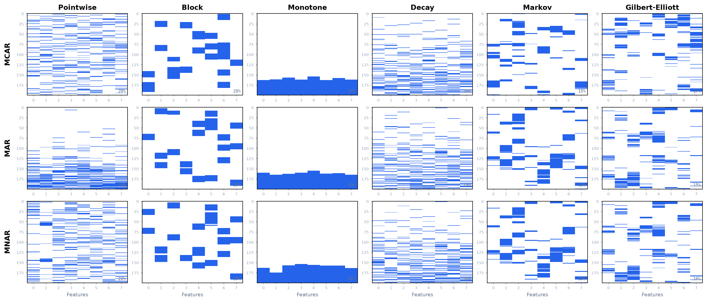
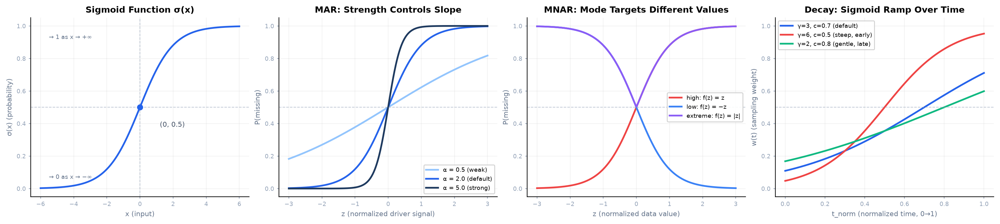

# Mathematical Details

This page describes how TSGap turns a complete time-series array into
`(X_missing, mask)`. The goal is to make the probability calculations and mask
construction explicit enough for reproducible benchmarking.

TSGap separates missingness into two steps:

1. A **mechanism** decides why entries are selected for missingness.
2. A **pattern** rearranges those selected entries in time.



The returned mask uses:

```text
mask == True  -> observed
mask == False -> missing
```

## Notation

Let the input array be either:

- `X` with shape `(T, D)` for one multivariate time series, or
- `X` with shape `(N, T, D)` for `N` samples or subjects.

Here `T` is the number of timesteps and `D` is the number of features.

Let `r` be the requested `missing_rate`. TSGap clips it to `[0, 1]`.

Let `E` be the eligible set of entries that may be artificially masked:

```text
E = entries that are not already NaN and belong to the target dimensions
```

Pre-existing NaNs are never converted back to observed values. They are marked
as missing in the returned mask but are excluded from the artificial missingness
rate calculation.

The achieved artificial missing rate over eligible entries is:

```math
\hat{r} = \frac{\#\{i \in E : mask_i = False\}}{|E|}
```

## Overall Algorithm

For a call such as:

```python
X_missing, mask = simulate_missingness(
    X,
    mechanism="mar",
    missing_rate=0.25,
    pattern="block",
    seed=42,
    driver_dims=[0],
    block_frac=(0.02, 0.10),
)
```

TSGap performs:

1. Create a NumPy random generator from `seed`.
2. Identify pre-existing NaNs.
3. Build the eligible set `E` from `target` and non-NaN entries.
4. Generate a mechanism mask.
5. Apply the temporal pattern to the mechanism mask.
6. Force pre-existing NaNs to remain missing.
7. Return `X_missing`, where all `mask == False` entries are set to `np.nan`.

## MCAR

MCAR means Missing Completely At Random. The data values do not affect the
probability of being masked.

TSGap samples exactly:

```math
m = round(r |E|)
```

eligible entries without replacement. If `U` is the sampled subset of `E`, then:

```math
mask_i =
\begin{cases}
False, & i \in U \\
True,  & i \in E \setminus U
\end{cases}
```

This gives exact missing-count control up to rounding. For example, if `|E| =
1000` and `r = 0.15`, TSGap masks exactly `round(1000 * 0.15) = 150` eligible
entries before any temporal pattern is applied.

## MAR

MAR means Missing At Random. Missingness depends on observed driver variables,
not directly on the value being masked.

### Driver Signal

For 2D data, if `driver_dims=[d_1, ..., d_K]`, the driver signal at timestep
`t` is either the average driver value:

```math
y_t = \frac{1}{K}\sum_{k=1}^{K} X_{t,d_k}
```

or, when `driver_weights=[w_1, ..., w_K]` is provided, a weighted driver value:

```math
y_t = \sum_{k=1}^{K} \tilde{w}_k X_{t,d_k}
```

where weights are normalized:

```math
\tilde{w}_k = \frac{w_k}{\sum_{j=1}^{K} w_j}
```

For 3D data, the same calculation is performed separately for each sample:

```math
y_{n,t} = \sum_{k=1}^{K} \tilde{w}_k X_{n,t,d_k}
```

### Normalization

For 2D data, the driver signal is normalized over time:

```math
s_t = \frac{y_t - mean(y)}{std(y)}
```

For 3D data, normalization is performed per sample:

```math
s_{n,t} = \frac{y_{n,t} - mean_t(y_{n,t})}{std_t(y_{n,t})}
```

If the standard deviation is numerically zero, TSGap uses a zero normalized
signal to avoid division by zero.

If `direction="negative"`, TSGap flips the signal:

```math
s \leftarrow -s
```

This means:

- `direction="positive"`: larger driver values imply larger missingness
  probability.
- `direction="negative"`: smaller driver values imply larger missingness
  probability.

### Logistic Probability

TSGap converts the normalized driver signal into a missingness probability with
a sigmoid function:

```math
p = \sigma(\alpha s + \beta)
```

where:

```math
\sigma(x) = \frac{1}{1 + exp(-x)}
```

`alpha` is `strength`, and `beta` is an offset calibrated by binary search.
For MAR, TSGap also applies a probability floor:

```math
p = max(p, base\_rate)
```

The probability is broadcast from each timestep to the eligible target features
at that timestep. Non-eligible entries receive probability zero.



### Offset Calibration

The offset `beta` is chosen so the mean missingness probability over eligible
entries matches the requested rate:

```math
\frac{1}{|E|}\sum_{i \in E} p_i \approx r
```

TSGap uses binary search because increasing `beta` monotonically increases the
probabilities. The search range is expanded when necessary and clipped for
numerical stability.

### Sampling

After probabilities are computed, each eligible entry is sampled independently:

```math
u_i \sim Uniform(0, 1)
```

```math
mask_i =
\begin{cases}
False, & u_i < p_i \\
True,  & u_i \ge p_i
\end{cases}
```

Because MAR samples Bernoulli outcomes, the achieved rate is approximate and can
vary more on small arrays.

## MNAR

MNAR means Missing Not At Random. Missingness depends on the value being masked.

### Value Normalization

For 2D data, each feature is normalized over time:

```math
z_{t,d} = \frac{X_{t,d} - mean_t(X_{t,d})}{std_t(X_{t,d})}
```

For 3D data, each sample-feature series is normalized separately:

```math
z_{n,t,d} = \frac{X_{n,t,d} - mean_t(X_{n,t,d})}{std_t(X_{n,t,d})}
```

If a standard deviation is numerically zero, TSGap uses `1.0` as the denominator
to avoid division by zero.

### MNAR Score

The score depends on `mnar_mode`:

```math
s =
\begin{cases}
z,      & \text{if mnar\_mode = "high"} \\
-z,     & \text{if mnar\_mode = "low"} \\
|z|,    & \text{if mnar\_mode = "extreme"}
\end{cases}
```

So:

- `"high"` makes high values more likely to be missing.
- `"low"` makes low values more likely to be missing.
- `"extreme"` makes values far from the mean more likely to be missing.

### Logistic Probability And Sampling

MNAR uses the same calibrated sigmoid structure as MAR:

```math
p_i = \sigma(\alpha s_i + \beta)
```

The offset `beta` is calibrated so:

```math
\frac{1}{|E|}\sum_{i \in E} p_i \approx r
```

Then each eligible entry is sampled independently:

```math
mask_i = False \quad \text{if} \quad u_i < p_i
```

As with MAR, the achieved rate is approximate because sampling is Bernoulli.

## Pointwise Pattern

The pointwise pattern is the default. It does not rearrange the mechanism mask.

If the mechanism selected entries:

```text
t = 1, 4, 9, 11, ...
```

the pointwise pattern leaves them as scattered missing points. Therefore:

- MCAR + pointwise gives uniformly scattered missing values.
- MAR + pointwise gives scattered missing values whose probabilities depend on
  driver variables.
- MNAR + pointwise gives scattered missing values whose probabilities depend on
  the values themselves.

## Block Pattern

The block pattern converts some or all mechanism-selected missingness into
contiguous runs along the time axis.

Let:

```math
M = \#\{i \in E : mask_i = False\}
```

be the number of missing entries selected by the mechanism.

The `block_density` parameter controls how much of this missingness is allocated
to blocks:

```math
M_{block} = floor(M \cdot block\_density)
```

```math
M_{point} = M - M_{block}
```

TSGap keeps `M_point` scattered missing entries and restores the rest before
adding contiguous blocks.

### Block Length

By default, blocks use an absolute sample length:

```text
block_len = 10
```

For long time series, `block_frac` is often more meaningful. A scalar
`block_frac=f` gives:

```math
L = round(T f)
```

clipped to the range `[1, T]`.

For example, with `T = 30000` and `block_frac = 0.02`:

```math
L = round(30000 \cdot 0.02) = 600
```

If `block_frac=(f_min, f_max)`, each block samples a new fraction:

```math
f_b \sim Uniform(f_{min}, f_{max})
```

```math
L_b = round(T f_b)
```

### Block Placement

For each block, TSGap:

1. Selects an eligible sample-feature series.
2. Samples a start time uniformly:

```math
t_0 \sim UniformInteger(0, T - L_b)
```

3. Masks eligible observed entries in:

```math
[t_0, t_0 + L_b)
```

4. Truncates the final block if needed to avoid overshooting the requested
   block missing count.

With enough eligible observed positions, this preserves the mechanism's missing
count while changing the temporal shape from scattered points into blocks.

## Monotone Pattern

The monotone pattern models dropout. Once a series becomes missing, later
eligible timesteps remain missing.

For each sample-feature series `(n, d)`, TSGap first computes the missing
density assigned by the mechanism:

```math
q_{n,d} =
\frac{\#\{t : mask_{n,t,d} = False \text{ and } (n,t,d) \in E\}}
     {\#\{t : (n,t,d) \in E\}}
```

The global missing budget is then allocated across series in proportion to
these densities:

```math
M_{n,d} \approx M \frac{q_{n,d}}{\sum_{n,d} q_{n,d}}
```

The dropout time is:

```math
\tau_{n,d} = T - M_{n,d}
```

All eligible entries from `tau` onward are masked:

```math
mask_{n,t,d} = False \quad \text{for all } t \ge \tau_{n,d}
```

This preserves the mechanism's influence: series with higher mechanism-assigned
missing density drop out earlier.

## Temporal Decay Pattern

The temporal decay pattern shifts missingness toward later timesteps.

First, TSGap creates normalized time values:

```math
\tilde{t} \in [0, 1]
```

Then it computes sigmoid time weights:

```math
w_t = \sigma(decay\_rate \cdot (\tilde{t} - decay\_center))
```

with a small floor:

```math
w_t = max(w_t, 0.01)
```

The number of missing entries selected by the mechanism is preserved:

```math
M = \#\{i \in E : mask_i = False\}
```

TSGap samples `M` eligible entries without replacement with probability
proportional to the time weight:

```math
P(i \text{ selected}) \propto w_{t(i)}
```

This means later timesteps are more likely to become missing, while earlier
timesteps can still be selected.

## Markov Pattern

The Markov pattern creates bursty temporal dependence. Each sample-feature
series is modeled with two states:

- observed
- missing

Let:

```math
\pi = \frac{M}{|E|}
```

be the target missing fraction after the mechanism step.

The `persist` parameter is:

```math
p_{persist} = P(missing_t \mid missing_{t-1})
```

It controls how likely a missing burst is to continue.

TSGap computes the onset probability from the stationary distribution:

```math
\pi = \frac{p_{onset}}{p_{onset} + 1 - p_{persist}}
```

Solving for `p_onset` gives:

```math
p_{onset} =
\frac{\pi (1 - p_{persist})}{1 - \pi}
```

Then each sample-feature series is simulated over time:

```math
P(missing_t \mid observed_{t-1}) = p_{onset}
```

```math
P(missing_t \mid missing_{t-1}) = p_{persist}
```

Higher `persist` values create longer missing bursts. Lower values create more
rapid flickering.

## Reproducibility

All randomness flows through NumPy's `Generator` API:

```python
rng = np.random.default_rng(seed)
```

Passing the same `seed` and the same configuration gives the same mask.

## Practical Interpretation

The mechanism controls the probability landscape:

- MCAR: every eligible point starts equally likely.
- MAR: probability follows observed driver variables.
- MNAR: probability follows the value being masked.

The pattern controls the temporal shape:

- pointwise: leave selected entries scattered.
- block: group selected entries into contiguous dropout episodes.
- monotone: move missingness into tail dropout.
- decay: shift missingness toward later timesteps.
- markov: create bursty on/off missingness.

Together, these two axes let users test whether an imputation method is robust
to both the statistical cause and temporal structure of missing data.
